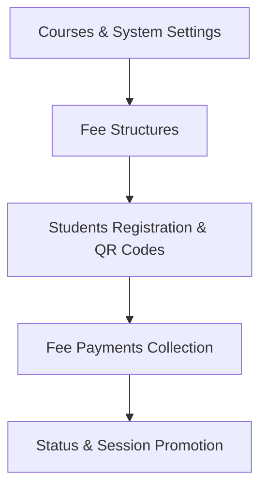

# Complete Overall Functioning Guide: College Fee Management System

This document provides a comprehensive, end-to-end breakdown of how this application operates, how student fees are calculated, how to identify fully submitted fees, how previous year dues are tracked across sessions, and how students are promoted to subsequent years.

---

## 1. System Architecture & Core Concepts

The application consists of 5 interconnected core pillars:



| Entity | Primary Table | Purpose |
| :--- | :--- | :--- |
| **Courses** | `courses` | Defines degree codes (e.g. `CS`, `B.A.`), duration type (`year`/`semester`), and total length (e.g. `4` years). |
| **Fee Structures** | `fee_structures` | Fee matrix defining Tuition, Exam, Library, and Other fees for every `(course_code, academic_year, duration_unit)`. |
| **Students** | `students` | Master records for students with auto-generated Roll No, QR code, current year/semester, and real-time fee balances. |
| **Fee Payments** | `fee_payments` | Transaction logs recording student payments, tagged as `current_year`, `previous_due`, `advance`, or `other`. |
| **Users** | `users` | Role-based system accounts (`admin` vs `staff`). |

---

## 2. How to Know When a Student's Fee is Fully Submitted

### A. In the User Interface
1. **Student List Page (`/students`)**:
   - Every student row displays **Total Fee** and **Pending Fee**.
   - **When Fully Paid (`Pending == 0`)**: The pending fee column renders a **GREEN badge with `0`** (`bg-emerald-50 text-emerald-700`).
   - **When Incomplete (`Pending > 0`)**: The column renders a **RED badge with the remaining amount** (e.g., `₹15,000.00 Left` in `bg-rose-50 text-rose-700`).

2. **Student Details Page (`/students/:id`)**:
   - In the **Fees Summary** card:
     - **Due for current year**: Shows the total amount from the fee structure.
     - **Paid this year**: Shows the sum of all payments made by this student.
     - **Pending fees**: Highlights in **Green `0 (Paid)`** if all fees are cleared, or in **Red** showing the exact remaining balance.
     - **Overall due**: Shows cumulative total liability across the student's entire tenure.

### B. In the Server & Database
The backend dynamically computes real-time status by joining `fee_structures` and `fee_payments`:

```sql
SELECT 
  s.id,
  s.college_roll_no,
  COALESCE(fs.total_fee, s.total_fees_due, 0) AS total_fees_due,
  COALESCE((SELECT SUM(amount) FROM fee_payments WHERE student_id = s.id), s.total_fees_paid, 0) AS total_fees_paid,
  MAX(0, COALESCE(fs.total_fee, s.total_fees_due, 0) - COALESCE((SELECT SUM(amount) FROM fee_payments WHERE student_id = s.id), s.total_fees_paid, 0)) AS pending_fees
FROM students s
LEFT JOIN fee_structures fs ON fs.course_code = s.course_code 
                           AND fs.academic_year = s.academic_year 
                           AND fs.duration_unit = s.current_duration_unit;
```
- When `total_fees_paid >= total_fees_due`, `pending_fees` evaluates to `0`.

---

## 3. How Promotion and Previous Year Dues Work

### A. How a Student is Promoted to the Next Year/Session
Promotion is the transition of a student from their current year/semester (e.g. Year 1) to the next (e.g. Year 2):

1. **Step 1: Admin/Staff navigates to `/students` and clicks `Edit`** on the student.
2. **Step 2: Update Session and Duration Unit**:
   - Change **Academic Year** from `2025-26` to `2026-27`.
   - Change **Current Year / Duration Unit** from `1` to `2`.
   - Click **Save**.
3. **Step 3: What the Server Does Automatically**:
   - Look up the new fee structure for `(course_code, '2026-27', 2)`.
   - Assigns the new year's `total_fees_due`.
   - Adds the new year's fee to `overall_total_due`.

---

### B. How Staff/Admin Track Previous Year Pending Dues in the Next Session

The application provides multi-level tracking for previous year pending balances:

#### 1. Filtered Audit by Academic Year & Duration Unit
On the **Student List (`/students`)**:
- Use the **Academic Year** dropdown (e.g., select `2025-26`) and **Current Year** dropdown (e.g., select `1`).
- Filter students to immediately see who from the previous session still has a **Red Pending Fee badge**.
- Any student showing a Red badge with remaining money is carrying pending dues from that session.

#### 2. The `overall_total_due` vs `total_fees_due` Metrics
In the student record:
- **`total_fees_due`**: Fee applicable strictly to the *current active year* (Year 2).
- **`overall_total_due`**: Cumulative fees accrued across *all years* (Year 1 + Year 2).
- **Previous Due Amount** = `(overall_total_due - current_year_total_fee) - previous_payments`.

#### 3. Tagging Payments specifically for Previous Dues
When a student pays their backlog/arrears from the previous session:
1. Navigate to **Fee Management (`/fees`)**.
2. Enter the student's Roll Number (e.g. `25CS001`).
3. Set the **Payment For** dropdown to **`Previous Due`**:
   - `Current Year`: Standard payment for the ongoing session.
   - `Previous Due`: Specifically marks clearance of previous session arrears.
   - `Advance`: Payment in advance for future units.
4. The transaction is permanently logged with `payment_for: 'previous_due'`.
5. Staff can query `GET /api/fees?payment_for=previous_due` to see an audit log of all recovered previous dues.

---

## 4. End-to-End Walkthrough Example

Let us follow a concrete student from admission to promotion and fee clearance.

### Scenario:
- **Course**: `CS` (Computer Science, 4 Years)
- **Fee Structure Configured**:
  - Year 1 (`2025-26`, Unit 1): Tuition ₹30,000 + Exam ₹5,000 + Library ₹5,000 = **Total ₹40,000**
  - Year 2 (`2026-27`, Unit 2): Tuition ₹35,000 + Exam ₹5,000 + Library ₹5,000 = **Total ₹45,000**

---

### Phase 1: Year 1 Registration (Session 2025-26)
1. Staff registers student **"Aman Verma"**:
   - Course: `CS`, Academic Year: `2025-26`, Unit: `1`.
2. System auto-generates Roll Number: `25CS002`.
3. System generates QR code linked to `/students/25CS002`.
4. **Initial Fee Status**:
   - Total Fee: `₹40,000.00`
   - Total Paid: `₹0.00`
   - Pending Fee: **`₹40,000.00 Left` [RED BADGE]**

---

### Phase 2: Year 1 Partial Payment
1. Aman visits the fee counter and pays ₹25,000.
2. Staff enters:
   - Student ID / Roll No: `25CS002`
   - Payment For: `Current Year`
   - Duration Unit: `1`
   - Amount: `25000`
3. Click **Record Payment**.
4. **Updated Fee Status**:
   - Total Fee: `₹40,000.00`
   - Total Paid: `₹25,000.00`
   - Pending Fee: **`₹15,000.00 Left` [RED BADGE]**

---

### Phase 3: Year 1 Final Clearance
1. Before exams, Aman pays the remaining ₹15,000.
2. Staff records `₹15,000.00` for `25CS002`.
3. **Updated Fee Status**:
   - Total Fee: `₹40,000.00`
   - Total Paid: `₹40,000.00`
   - Pending Fee: **`0` [GREEN BADGE]**
4. Staff can instantly see in `/students` that Aman's Year 1 fee is **100% complete**.

---

### Phase 4: Session Change & Promotion to Year 2 (Session 2026-27)

#### Case A: Promoted When Fees Were Fully Cleared
1. Admin edits Aman:
   - Academic Year: `2026-27`
   - Current Duration Unit: `2`
2. The system links the Year 2 fee structure (`₹45,000.00`).
3. **Status at start of Year 2**:
   - Total Fee (Year 2): `₹45,000.00`
   - Year 1 Pending: `₹0.00`
   - Pending Fee: **`₹45,000.00 Left` [RED BADGE]** (Only Year 2 fee is pending).

#### Case B: Promoted With Previous Year Pending Due (e.g. ₹15,000 unpaid)
If Aman had only paid ₹25,000 in Year 1 and was promoted:
1. When staff filters the Student List by `2025-26` / `Year 1`, Aman shows with **`₹15,000.00 Left` (Red)**.
2. When Aman comes to pay the old balance, staff opens `/fees`:
   - Student ID / Roll No: `25CS002`
   - Payment For: **`Previous Due`**
   - Duration Unit: `1`
   - Amount: `15000`
3. The payment is logged against the previous session dues.

---

## 5. Complete Summary of All Application Sections

| Section | Route | Target Audience | Primary Function |
| :--- | :--- | :--- | :--- |
| **Login** | `/login` | Admin & Staff | Authentication with JWT tokens and redirect to reset password if forced reset is active. |
| **Reset Password** | `/reset-password` | Users with forced reset | Compulsory password update screen with confirmation and length validation. |
| **Dashboard** | `/dashboard` | Admin & Staff | High-level summary hub for portal navigation. |
| **Student List** | `/students` | Admin & Staff | View all students, photo thumbnails, roll numbers, Total Fee, Pending Fee (Green `0` or Red Left amount), QR codes, and search filters. |
| **New Student** | `/students/new` | Admin & Staff | Add students with course selection, automatic roll number calculation (`{Year}{Course}{Sequence}`), and QR code generation. |
| **Edit Student** | `/students/:id/edit` | Admin & Staff | Update details, promote to next duration unit / academic year, and upload photos. |
| **Student Detail** | `/students/:id` or `/student/:rollNo` | Admin & Staff (or QR scan) | Full profile overview, printable QR code, course details, and complete Fee Summary. |
| **Fee Capture** | `/fees` | Admin & Staff | Capture student fee payments by typing student Roll Number (e.g. `25CS001`) or ID, selecting payment type (`current_year`, `previous_due`), and viewing transaction history. |
| **Fee Structures** | `/fee-structures` | Admin Only | Configure fee templates broken down into Tuition, Exam, Library, and Other fees for every course, session, and year/semester. |
| **Courses** | `/courses` | Admin Only | Create and manage college degrees, duration types (`year` vs `semester`), and durations. |
| **Users** | `/users` | Admin Only | Staff management: create staff accounts, toggle forced password reset, and manage credentials. |
| **System Settings** | `/system-settings` | Admin Only | Configure college display name, current default academic year (e.g. `2025-26`), and default user passwords. |
