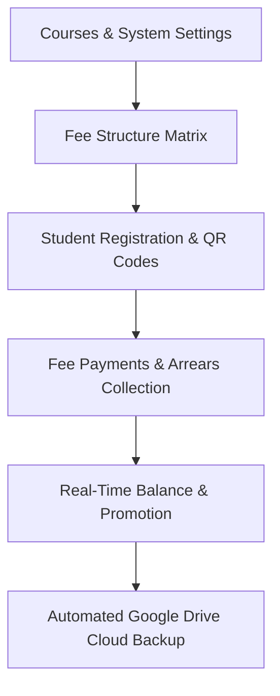
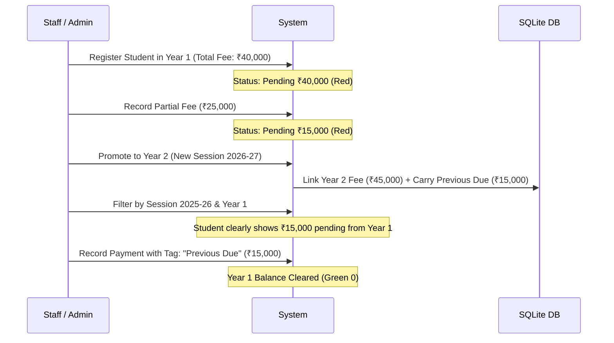

# 🎓 College Fee Management & Student Information System

> **Local-First, High-Performance, Zero-Cost Infrastructure for Educational Institutions**  
> Complete student admission, automated roll number and QR code generation, course management, multi-term fee tracking, local Wi-Fi multi-device access, and automated cloud backup to Google Drive.

---

## 📌 Table of Contents

1. [System Overview & How the App Works](#1-system-overview--how-the-app-works)
2. [The Zero-Cost Architecture (100% Free Lifetime Operation)](#2-the-zero-cost-architecture-100-free-lifetime-operation)
3. [Why SQLite? Technical & Institutional Benefits](#3-why-sqlite-technical--institutional-benefits)
4. [Using Your Device as Server & Database (Local-First Multi-Device Setup)](#4-using-your-device-as-server--database-local-first-multi-device-setup)
5. [Automated Google Drive Cloud Backup (15 GB Free Cloud Storage)](#5-automated-google-drive-cloud-backup-15-gb-free-cloud-storage)
6. [Technology Stack](#6-technology-stack)
7. [Prerequisites](#7-prerequisites)
8. [Step-by-Step Guide to Run the App (Terminal Commands)](#8-step-by-step-guide-to-run-the-app-terminal-commands)
   - [Development Mode (Local Coding & Testing)](#method-a-development-mode)
   - [Automated Windows Environment & Firewall Setup](#method-b-automated-windows-environment-setup)
   - [Building the Standalone Windows Installer (.exe)](#method-c-building-the-standalone-windows-installer-exe)
   - [Running the Installed Production Application](#method-d-running-the-installed-production-application)
9. [How Student Promotion & Previous Dues Work](#9-how-student-promotion--previous-dues-work)
10. [Hardware Migration & Disaster Recovery](#10-hardware-migration--disaster-recovery)
11. [Troubleshooting & Network Configuration](#11-troubleshooting--network-configuration)
12. [Repository Directory Structure](#12-repository-directory-structure)

---

## 1. System Overview & How the App Works

The **College Fee Management System** is an offline-capable, local-first web application designed for colleges, institutes, and schools to streamline student admissions and fee collections without relying on expensive monthly SaaS subscriptions or complex server setups.



### Core Workflow & Pillars:

1. **Courses & Duration Management (`/courses`)**:
   - Define degrees and programs (e.g. `B.Tech`, `BCA`, `B.A.`, `MBA`).
   - Configure duration type (`Year`-based or `Semester`-based) and total duration length.

2. **Fee Structure Matrix (`/fee-structures`)**:
   - Establish breakdown templates (Tuition Fee, Examination Fee, Library Fee, Other Charges).
   - Configured dynamically for each specific `(course_code, academic_year, duration_unit)`.

3. **Student Registration & QR Generation (`/students/new`)**:
   - Register students with personal details, category, contact information, and photo upload.
   - **Automated Roll Number Engine**: Instantly generates standardized roll numbers adhering to the format: `{2-digit Year}{Course Code}{Sequence Number}` (e.g., `25CS001`).
   - **Dynamic QR Code Generation**: Automatically creates a printable QR code linking directly to the student's profile for instant mobile camera or barcode scanner lookup.

4. **Fee Collection & Real-Time Tracking (`/fees`)**:
   - Search students instantly by Roll Number or Name.
   - Categorize receipts: `Current Year`, `Previous Due` (clearing past arrears), `Advance` (future fees), or `Other`.
   - Automatically deducts paid amounts from dues and produces printable receipt logs.

5. **Visual Fee Status Indicators**:
   - **Fully Paid (`Pending == 0`)**: Displays a prominent **Green Badge with `0`** (`bg-emerald-50 text-emerald-700`).
   - **Pending Dues (`Pending > 0`)**: Displays a **Red Alert Badge** with the exact remaining balance (e.g. `₹15,000.00 Left`).

6. **Multi-Device Wi-Fi Connectivity**:
   - Run the application on one main computer (the Host).
   - Any authorized staff member with a laptop, tablet, or smartphone connected to the same office Wi-Fi can open and use the application concurrently via browser.

---

## 2. The Zero-Cost Architecture (100% Free Lifetime Operation)

Most commercial college management systems charge thousands of dollars each year for cloud hosting, managed databases, maintenance fees, and per-student licensing. This application is architected from the ground up for **$0 / ₹0 lifetime cost**.

| Component | Traditional SaaS / Cloud Software | This Application's Zero-Cost Model | Savings |
| :--- | :--- | :--- | :--- |
| **Server Hosting** | AWS / Azure / Heroku / DigitalOcean VPS ($20–$150/mo) | **$0** — Your existing office PC/laptop acts as the web server | 100% Free |
| **Database Server** | Managed RDS / MongoDB Atlas / Supabase ($15–$100/mo) | **$0** — High-speed embedded SQLite database running locally | 100% Free |
| **Cloud Backup Storage** | AWS S3 / Cloud Volumes ($10–$50/mo) | **$0** — Google Drive 15 GB free personal/college storage tier | 100% Free |
| **Client Licenses** | Per-seat or per-student monthly subscription fee | **$0** — Unlimited devices, unlimited staff members, unlimited students | 100% Free |
| **Total Cost of Ownership** | **$500 to $3,000+ every single year** | **$0.00 (Completely Free Forever)** | **Zero Recurring Bills** |

### How Zero-Cost Directly Benefits the User & Institution:
- **No Recurring Expenses**: Never worry about credit cards expiring, price hikes, or vendor lock-in.
- **Complete Data Sovereignty & Privacy**: Student records, financial logs, and contact details stay physically on your own computer—never shared with third-party tracking or advertising networks.
- **Full Offline Independence**: Even if internet service goes down, the entire fee counter, admission desk, and student search functions remain 100% operational over local Wi-Fi.

---

## 3. Why SQLite? Technical & Institutional Benefits

Instead of requiring heavy, complex database services like MySQL, PostgreSQL, or Oracle that consume massive background RAM and require dedicated database administrators, this application leverages **SQLite (with WAL mode enabled)**.

### 1. Zero Configuration & No Background Daemons
SQLite is an embedded, serverless database engine. There is no MySQL/PostgreSQL Windows service to install, configure, start, or troubleshoot. It starts instantly whenever the app opens.

### 2. Blazing Fast Performance with WAL (Write-Ahead Logging)
The application enables SQLite's high-concurrency WAL mode (`PRAGMA journal_mode = WAL;`):
- **Concurrent Reads & Writes**: Reading queries (e.g., student lists, fee checks) do not block write operations (e.g., recording a fee payment).
- **Sub-Millisecond Query Response**: Because SQLite communicates directly in-process with Node.js on the local SSD, response times are faster than remote cloud databases.

### 3. Ultimate Portability (Single-File Database)
All courses, fee structures, students, users, payment transactions, and sync records reside inside one compact file:
```text
C:\CollegeData\college.db
```
Backing up, transferring, or archiving your entire institutional history requires nothing more than copying that single file.

### 4. ACID Compliance & Crash Resilience
SQLite transactions are atomic, consistent, isolated, and durable (ACID). If the host computer suffers a sudden power outage or battery drain while a payment is being recorded, SQLite's write-ahead log automatically rolls back incomplete transactions, guaranteeing zero database corruption.

---

## 4. Using Your Device as Server & Database (Local-First Multi-Device Setup)

You do **not** need an expensive dedicated server rack. Any standard Windows laptop or desktop computer running in your administrative office serves as both the **Web Server** and the **Database Host**.

```text
 ┌────────────────────────────────────────────────────────┐
 │            HOST COMPUTER (Administration PC)           │
 │  • Node.js Backend Server (Port 5000)                  │
 │  • SQLite Database (C:\CollegeData\college.db)         │
 │  • Uploads Folder (C:\CollegeData\uploads)             │
 └───────────────────────────┬────────────────────────────┘
                             │ Local Wi-Fi Router
             ┌───────────────┼───────────────┐
             ▼               ▼               ▼
      [Staff Laptop]    [Fee Counter]    [Mobile Phone]
       Chrome/Edge      Chrome/Firefox    Safari/Chrome
```

### How Multi-Device Access Works:
1. **The Host Starts the Server**: When launched, the backend binds to all local network interfaces (`0.0.0.0:5000`).
2. **Permanent Storage**: All records and uploaded photos are kept in `C:\CollegeData`. This folder is permanently preserved even if you reinstall or upgrade the software.
3. **Connecting Secondary Devices**:
   - Connect client devices (phones, tablets, laptops) to the **same office Wi-Fi network**.
   - Click the **Wi-Fi Icon** in the top navigation bar of the application to view the Host computer's local network IP (e.g. `http://192.168.1.15:5000`).
   - Scan the on-screen QR code with any smartphone camera or enter the URL directly into any browser.
4. **App-Like Mobile Experience**:
   - In Google Chrome (Android): Tap `⋮` $\rightarrow$ **Add to Home screen**.
   - In Safari (iPhone): Tap `Share` $\rightarrow$ **Add to Home Screen**.
   - The fee management system opens in full-screen mode like a native mobile app!

---

## 5. Automated Google Drive Cloud Backup (15 GB Free Cloud Storage)

Every standard Google Account (Gmail or Google Workspace) provides **15 GB of cloud storage free of charge**. This application includes a built-in, native Google Drive synchronization engine that leverages this free space for offsite backup and disaster recovery.

### Why Google Drive's 15 GB Free Tier is Ideal:
- A complete college database (`college.db`) with thousands of student records typically occupies between **2 MB and 15 MB**.
- Even with thousands of high-resolution student photos and receipt attachments, 15 GB provides enough capacity for **decades** of uninterrupted, free backups.

### How Google Drive Sync Works:
1. **One-Click Secure Authentication (`/google-sync`)**:
   - Connect your Google account directly from the UI using official Google OAuth 2.0.
   - The application automatically creates an isolated cloud backup folder:  
     `"College Management System Backup"`.
2. **Automated Background Synchronization**:
   - A background scheduler runs automatically inside the server (default: every **5 minutes**).
   - Syncs the latest `college.db` database snapshot and all new uploaded photos/receipts in `C:\CollegeData\uploads\`.
3. **Manual Backup ("Sync Now")**:
   - Admins can trigger an immediate on-demand synchronization before closing the office for the day.
4. **Detailed Audit History**:
   - Inspect timestamped commit histories, items synced, file sizes, and status directly in the UI.
5. **One-Click Disaster Recovery (Cloud Restore)**:
   - If the host computer is lost, stolen, or damaged, simply install the app on a new PC, connect the same Google account, and click **Restore from Google Drive**.
   - The system automatically downloads `college.db`, refreshes fee balances, and restores full operations within seconds.

---

## 6. Technology Stack

### Frontend:
- **Framework**: [React 18](https://react.dev/) + [TypeScript](https://www.typescriptlang.org/)
- **Bundler & Dev Server**: [Vite 5](https://vitejs.dev/)
- **Styling**: [Tailwind CSS](https://tailwindcss.com/)
- **Routing**: [React Router Dom v6](https://reactrouter.com/)
- **HTTP Client**: [Axios](https://axios-http.com/)

### Backend:
- **Runtime**: [Node.js](https://nodejs.org/) (LTS v18 / v20+)
- **Framework**: [Express.js](https://expressjs.com/) with TypeScript
- **Database Engine**: [SQLite3](https://www.sqlite.org/) with `sqlite` promise driver (WAL Mode)
- **Cloud Integration**: Official Google APIs Client Library (`googleapis` v3)
- **File Uploads**: [Multer](https://github.com/expressjs/multer) (organized local storage)
- **Security & Auth**: [JSON Web Tokens (JWT)](https://jwt.io/) & [bcryptjs](https://github.com/dcodeIO/bcrypt.js)
- **Utilities**: [qrcode](https://www.npmjs.com/package/qrcode) (SVG & DataURL QR generation)

### Windows Packaging & Tooling:
- **Installer Builder**: [Inno Setup 6](https://jrsoftware.org/isinfo.php) (modern LZMA2 solid compression)
- **Native Launchers**: C# (.NET Framework 4.0 `csc.exe`) for background process management (`CollegeFeeManagement.exe` & `StopCollegeApp.exe`)
- **Automated Scripts**: Windows Batch scripts for environment variables and firewall configuration

---

## 7. Prerequisites

Before running the terminal scripts, ensure the following are installed on the Host computer:

1. **Node.js**: Version 18.x or 20.x LTS ([Download Node.js](https://nodejs.org/))
2. **Git**: (Optional, for cloning repository)
3. **Inno Setup 6**: ([Download Inno Setup](https://jrsoftware.org/isdl.php)) *(Only required if compiling the `.exe` installer)*
4. **Operating System**: Windows 10 or Windows 11 (64-bit recommended)

---

## 8. Step-by-Step Guide to Run the App (Terminal Commands)

### Method A: Development Mode

Follow these terminal commands to run the frontend and backend in developer live-reload mode.

#### Step 1: Install Dependencies
Open your terminal (PowerShell or Command Prompt) at the repository root `d:\clg-app`:

```bash
# 1. Install Backend Dependencies
cd server
npm install

# 2. Install Frontend Dependencies
cd ../client
npm install
```

#### Step 2: Configure Environment Variables
Inside the `server/` directory, ensure a `.env` file exists (a default `.env` is provided).

Key `.env` settings:
```ini
PORT=5000
HOST=0.0.0.0
DATABASE_PATH=./college.db
UPLOADS_DIR=./uploads
DEFAULT_ADMIN_EMAIL=admin@college.local
DEFAULT_ADMIN_PASSWORD=password123
JWT_SECRET=replace-with-a-secure-secret-key-2026
FRONTEND_URL=http://localhost:5173

# Google Drive Cloud Backup (OAuth 2.0 Credentials)
GOOGLE_CLIENT_ID=your-google-client-id.apps.googleusercontent.com
GOOGLE_CLIENT_SECRET=your-google-client-secret
GOOGLE_REDIRECT_URI=http://localhost:5000/api/google/callback
GOOGLE_DRIVE_FOLDER_NAME=College Management System Backup
SYNC_INTERVAL_MINUTES=5
```

#### Step 3: Start the Backend Server
In terminal window 1:
```bash
cd server
npm run dev
```
> The API server will start on `http://0.0.0.0:5000`.

#### Step 4: Start the Frontend Client
In terminal window 2:
```bash
cd client
npm run dev
```
> Vite dev server will start on `http://localhost:5173`. Open this URL in your browser.

---

### Method B: Automated Windows Environment Setup

To permanently configure the host PC's database directory and automatically unblock the Windows Firewall for local network Wi-Fi devices, run the included setup script:

```bat
# Right-click and choose "Run as administrator" or execute in an elevated terminal:
.\setup-windows-env.bat
```

**What this script performs:**
1. Prompts you to confirm or customize your permanent data directory (Default: `C:\CollegeData`).
2. Creates the directory hierarchy:
   - `C:\CollegeData\college.db`
   - `C:\CollegeData\uploads\students`
   - `C:\CollegeData\uploads\qrcodes`
3. Sets permanent Windows System Environment Variables (`DATABASE_PATH`, `UPLOADS_DIR`, `PORT=5000`, `HOST=0.0.0.0`).
4. Adds inbound Windows Defender Firewall rules for TCP ports `5000` and `5173`.

---

### Method C: Building the Standalone Windows Installer (.exe)

You can build a single, standalone, offline Windows setup executable (`CollegeFeeManagement-Setup.exe`) that packages the Node runtime, backend build, frontend build, native launchers, and firewall configuration into one installer.

Run the build script in the terminal from the project root:

```bat
.\build-installer.bat
```

#### Terminal Execution Breakdown of `build-installer.bat`:
1. **Step 0/5 - Icon Generation**: Compiles `installer_build\IconBuilder.cs` using the Windows .NET C# compiler (`csc.exe`) and converts `assets\clg-icon.png` into `assets\app.ico`.
2. **Step 1/5 - Frontend Build**: Executes `npm run build` inside `client/` to compile optimized static assets into `client/dist`.
3. **Step 2/5 - Backend Build**: Executes `npm run build` inside `server/` using TypeScript (`tsc`) to compile backend code into `server/dist`.
4. **Step 3/5 - Native C# Launchers**: Compiles:
   - `CollegeFeeManagement.exe` (from `Launcher.cs`): Silently launches Node.js in the background without showing ugly command prompt windows and automatically opens the user's default browser to `http://localhost:5000`.
   - `StopCollegeApp.exe` (from `StopApp.cs`): Gracefully stops any active background server processes.
5. **Step 4/5 - Staging Assembly**: Copies the standalone `node.exe` runtime, compiled assets, frontend files, and configuration into `installer_build\staging`.
6. **Step 5/5 - Inno Setup Packaging**: Invokes Inno Setup (`ISCC.exe`) with `installer_build\installer.iss`.

Output executable is generated at:
```text
installer_output\CollegeFeeManagement-Setup.exe
```

---

### Method D: Running the Installed Production Application

1. Run `CollegeFeeManagement-Setup.exe` on the host PC as **Administrator**.
2. Select your preferred database folder (Default: `C:\CollegeData`).
3. Finish the wizard.
4. Launch the application:
   - Double-click the **College Fee Management** shortcut on your Desktop.
   - The launcher starts the background service and opens your browser at:
     ```text
     http://localhost:5000
     ```
5. **Default Admin Login**:
   - **Email**: `admin@college.local`
   - **Password**: `password123` *(You can update this immediately in System Settings / Users)*.
6. **Stopping the App**:
   - Double-click the Start Menu shortcut **Stop College Fee Management** or run `StopCollegeApp.exe`.

---

## 9. How Student Promotion & Previous Dues Work

A critical challenge for colleges is tracking students who get promoted to subsequent years while carrying unpaid fee balances from previous sessions.



### 1. Promoting a Student:
- Navigate to **Student List (`/students`)** and click **Edit** on the student.
- Change the **Academic Year** (e.g. `2025-26` $\rightarrow$ `2026-27`) and **Current Year / Duration Unit** (e.g. `1` $\rightarrow$ `2`).
- Click **Save**. The server links the new year's fee structure and updates cumulative liabilities (`overall_total_due`).

### 2. Identifying Previous Dues:
- In `/students`, use the **Academic Year** and **Current Year** filters.
- Any student with an unpaid balance from a prior session displays a **Red Pending Fee Badge**.

### 3. Collecting Previous Year Dues:
- Open **Fee Management (`/fees`)** and input the student's Roll Number.
- Set the **Payment For** dropdown to **`Previous Due`**.
- Enter the amount and record the payment. The transaction is permanently logged under the previous session's ledger.

---

## 10. Hardware Migration & Disaster Recovery

If you ever need to replace your host computer or recover from hardware failure, data migration takes less than 2 minutes.

### Option 1: Via Google Drive (Zero-Touch Cloud Restore)
1. Install `CollegeFeeManagement-Setup.exe` on the new PC.
2. Launch the app and log in.
3. Navigate to **Google Drive Sync (`/google-sync`)**.
4. Sign in with the college Google account.
5. Click **Restore from Google Drive**.
6. The app pulls down `college.db`, updates student balances, and restores full operations.

### Option 2: Via USB Flash Drive (Manual Copy)
1. On the old PC, open Windows Explorer and copy `C:\CollegeData` to a USB drive.
2. On the new PC, copy the `CollegeData` folder to `C:\CollegeData`.
3. Install `CollegeFeeManagement-Setup.exe` on the new PC and select `C:\CollegeData`.
4. Launch the application. All student profiles, fee histories, and photos will appear intact.

---

## 11. Troubleshooting & Network Configuration

| Issue | Cause | Solution |
| :--- | :--- | :--- |
| **"This site can't be reached" on other devices** | Wrong Port specified | Ensure other devices enter port **`5000`** (`http://192.168.x.x:5000`), **not** port `5173`. |
| **Connection timed out on Wi-Fi** | Network marked as "Public" | In Windows Network Settings on the Host PC, switch the connection profile from **Public network** to **Private network**. |
| **Firewall blocking incoming traffic** | Firewall rule missing | Right-click `allow-wifi-firewall.bat` or `setup-windows-env.bat` and select **Run as administrator**. |
| **Mobile phone refuses to connect** | Mobile Data (4G/5G) conflict | Temporarily turn **OFF Mobile Data** on the smartphone so traffic routes via local Wi-Fi. Verify URL uses `http://` (not `https://`). |
| **Devices on same Wi-Fi cannot see each other** | Router "AP Isolation" active | Some office/guest Wi-Fi routers disable device-to-device communication. Turn on a mobile hotspot to test; if it works on the hotspot, ask your network administrator to disable **AP/Client Isolation** on the router. |
| **Google Drive connection fails** | Missing Drive permission | During Google OAuth sign-in, check the checkbox granting permission to create and manage files in Google Drive. |

---

## 12. Repository Directory Structure

```text
d:\clg-app\
│
├── assets\                         # Application icon, logo, and artwork
│   ├── app.ico                     # Windows application icon
│   └── clg-icon.png                # High-res PNG logo
│
├── client\                         # React 18 + Vite + Tailwind CSS Frontend
│   ├── public\                     # Static public assets & favicons
│   ├── src\
│   │   ├── components\             # Reusable UI components (Navbar, Modals, Badges)
│   │   ├── contexts\               # AuthContext, SyncContext
│   │   ├── lib\                    # Axios API client & Sync API helpers
│   │   ├── pages\                  # StudentList, FeeManagement, GoogleDriveSync, etc.
│   │   ├── App.tsx                 # Route declarations & layout
│   │   └── main.tsx                # Client entry point
│   ├── package.json
│   └── vite.config.ts
│
├── server\                         # Node.js + Express + TypeScript Backend
│   ├── src\
│   │   ├── middleware\             # JWT auth & role validation middleware
│   │   ├── routes\                 # REST endpoints (students, fees, google, sync, etc.)
│   │   ├── services\               # Business logic (googleDriveService, syncEngine, etc.)
│   │   ├── utils\                  # Path resolvers, formatting utilities
│   │   ├── db.ts                   # SQLite connection, WAL mode & migrations
│   │   └── index.ts                # Express server entry point
│   ├── .env                        # Server configuration & Google OAuth keys
│   └── package.json
│
├── installer_build\                # Windows Standalone Installer Source
│   ├── staging\                    # Bundled distribution staging folder
│   ├── IconBuilder.cs              # C# PNG to ICO converter source
│   ├── Launcher.cs                 # C# Silent background Node.js launcher source
│   ├── StopApp.cs                  # C# Background process terminator source
│   └── installer.iss               # Inno Setup 6 compilation script
│
├── installer_output\               # Compiled distribution output
│   └── CollegeFeeManagement-Setup.exe # Finished Windows installer
│
├── allow-wifi-firewall.bat         # Quick script to unblock port 5000 in Windows Firewall
├── build-installer.bat             # Automated 5-step installer builder script
├── setup-windows-env.bat           # Environment variable and network initialization script
├── APP_FUNCTIONING_AND_FEE_GUIDE.md# In-depth operational fee calculations guide
├── STEP_BY_STEP_INSTALLATION_GUIDE.md # Client device setup & troubleshooting guide
└── README.md                       # Complete documentation (This file)
```

---

## 📄 License & Attribution

This project is licensed for educational and institutional fee administration. Designed with a **local-first, zero-recurring-cost** philosophy to ensure financial and data independence for schools and colleges.
